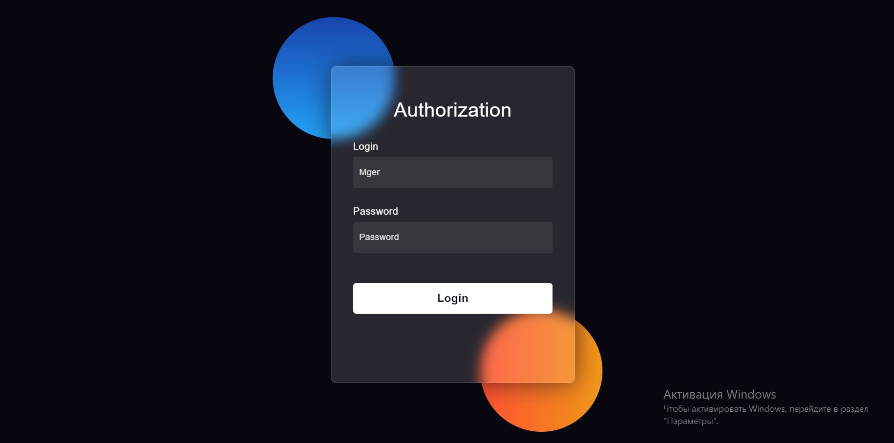
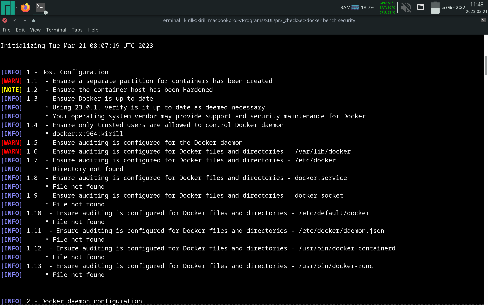
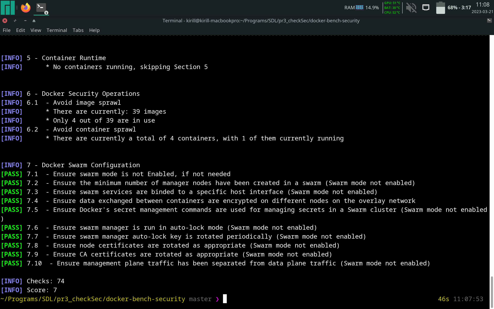
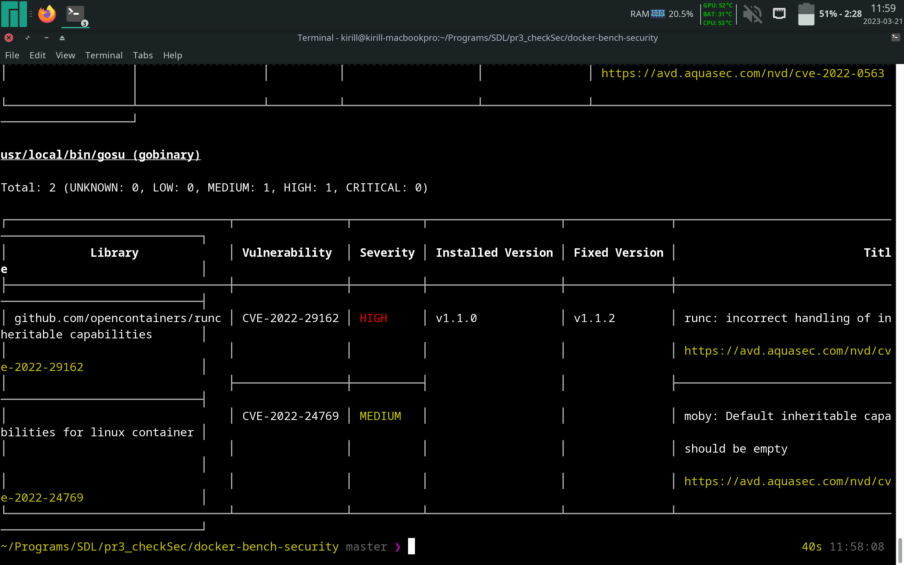

# Контейнер с тестовым проектом - HTML + nginx

1. Создадим Dockerfile:

php
```dockerfile
    FROM php:fpm
    RUN apt-get update && docker-php-ext-install mysqli
```

nginx
```dockerfile
    FROM nginx
    ADD ./default.conf /etc/nginx/conf.d
```

2. Создадим простую HTML-страницу:

```html
<!DOCTYPE html>
<html lang="en">
    <head>
        <!-- Design by foolishdeveloper.com -->
        <title>Glassmorphism login Form Tutorial in html css</title>
        <!--Stylesheet-->
        <style media="screen">
            *,
        *:before,
        *:after{
            padding: 0;
            margin: 0;
            box-sizing: border-box;
        }
        body{
            background-color: #080710;
        }
        .background{
            width: 430px;
            height: 520px;
            position: absolute;
            transform: translate(-50%,-50%);
            left: 50%;
            top: 50%;
        }
        .background .shape{
            height: 200px;
            width: 200px;
            position: absolute;
            border-radius: 50%;
        }
        .shape:first-child{
            background: linear-gradient(
                #1845ad,
                #23a2f6
            );
            left: -80px;
            top: -80px;
        }
        .shape:last-child{
            background: linear-gradient(
                to right,
                #ff512f,
                #f09819
            );
            right: -30px;
            bottom: -80px;
        }
        form{
            height: 520px;
            width: 400px;
            background-color: rgba(255,255,255,0.13);
            position: absolute;
            transform: translate(-50%,-50%);
            top: 50%;
            left: 50%;
            border-radius: 10px;
            backdrop-filter: blur(10px);
            border: 2px solid rgba(255,255,255,0.1);
            box-shadow: 0 0 40px rgba(8,7,16,0.6);
            padding: 50px 35px;
        }
        form *{
            font-family: 'Poppins',sans-serif;
            color: #ffffff;
            letter-spacing: 0.5px;
            outline: none;
            border: none;
        }
        form h3{
            font-size: 32px;
            font-weight: 500;
            line-height: 42px;
            text-align: center;
        }

        label{
            display: block;
            margin-top: 30px;
            font-size: 16px;
            font-weight: 500;
        }

        label.failed{
            text-align: center;
            color: red;
            font-size: 18px;
            font-weight: 600;
        }

        label.success{
            text-align: center;
            color: green;
            font-size: 18px;
            font-weight: 600;
        }

        input{
            display: block;
            height: 50px;
            width: 100%;
            background-color: rgba(255,255,255,0.07);
            border-radius: 3px;
            padding: 0 10px;
            margin-top: 8px;
            font-size: 14px;
            font-weight: 300;
        }
        ::placeholder{
            color: #e5e5e5;
        }
        input[type=submit]{
            margin-top: 50px;
            width: 100%;
            background-color: #ffffff;
            color: #080710;
            padding: 15px 0;
            font-size: 18px;
            font-weight: 600;
            border-radius: 5px;
            cursor: pointer;
        }
        </style>
    </head>
    <body>
        <div class="background">
            <div class="shape"></div>
            <div class="shape"></div>
        </div>
        <form action="/mg.php" method="POST">
            <h3>Authorization</h3>

            <label for="username">Login</label>
            <input type="text" placeholder="Mger" id="username">

            <label for="password">Password</label>
            <input type="password" placeholder="Password" id="password">

            <input type="submit" value="Login" name="Login">
        </form>
    </body>
</html>
```

3. Для корректной работы сервера nginx создадим конфигурационный файл:

```
server {
    listen 80;

    root /var/www/html;

    set_real_ip_from 172.19.0.1;
    proxy_set_header X-Real-IP $remote_addr;

    location / {
        
    }

    location ~ \.php$ {
        include fastcgi_params;
        fastcgi_pass php-brute:9000;
        fastcgi_param SCRIPT_FILENAME $document_root$fastcgi_script_name;
    }
}
```

4. Соберем Docker-образ и запустим контейнер:
    
        docker-compose up --build

5. В итоге, получаем по адресу "localhost:8080/form.php" следующую страницу:

    

# Проверка Docker-контейнеров на безопасность

1. Для начала, воспользуемся утилитой docker-bench-security:

Программа анализирует конфигурацию Docker на нашем хосте. На основании данных
сообщений, можно выполнить необходимую конфигурацию.





На Рис. 2 можно наблюдать, что на машине не создано изолированное хранилище для
Docker - это необходимо, так как Docker выполняется от суперпользователя и с
помощью уязвимостей можно получить root-доступ к машине. 

2. Воспользуемся утилитой trivy:
    
Она позволяет проверить Docker-образ на наличие уязвимостей с их указанием. Это
помогает настроить образ под конкретные задачи, закрыв возможность
эксплуатировать уязвимость. К примеру, проверим образ "redis":



На Рис. 4 видно, что trivy обнаружила уязвимость CVE-2022-29162, которая
обозначает, что в runc до версии 1.1.2 была обнаружена ошибка, когда `runc exec
--cap` создавал процессы с непустыми наследуемыми возможностями процессов Linux,
создавая нетипичную среду Linux и позволяя программам с наследуемыми файловыми
возможностями повышать эти возможности до разрешенных. устанавливается во время
execve. 

Поэтому, рекомендуется регулярно ставить обновления на образы, чтобы постепенно
закрывать уязвимости, которые не удастся устранить при конкретной конфигурации.